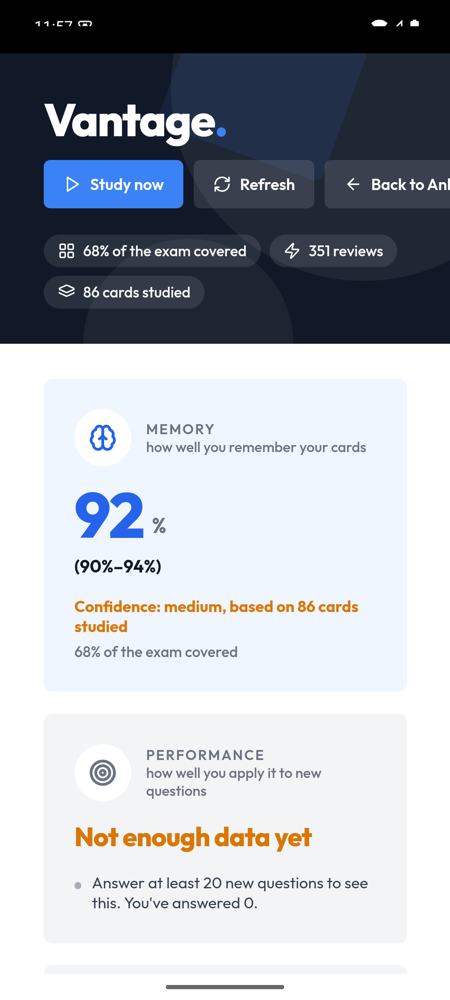

# Vantage (MCAT readiness) — Android

This is a small, focused fork of [AnkiDroid](https://github.com/ankidroid/Anki-Android): the phone client for **Vantage**, an MCAT-readiness study app built on Anki. The shared topic-interleaving Rust engine is compiled into the app's backend, and on top of it this fork adds a single dashboard screen. That screen reports three honest scores (memory, performance, readiness), each with a range, plus exam coverage and the best next topic, all computed on-device from the phone's own collection and matching the desktop UI.



*The Vantage dashboard on a phone: memory at 92% with a range, performance and readiness in the honest "not enough data yet" state, and 68% exam coverage.*

## What this fork changes

The change is intentionally small and easy to diff against upstream. Two files carry it:

- `AnkiDroid/src/main/java/com/ichi2/anki/VantageDashboardActivity.kt` — a WebView host and collection bridge. It loads `file:///android_asset/vantage/index.html`, exposes a `pycmdBridge` JS interface that mirrors desktop `pycmd`, queries the local collection (FSRS retrievability, graded reviews, merged performance outcomes), injects live scores via `window.vantageComputeFromRaw(...)`, writes confusability data to the `vantage.interleave` config for the Rust interleaver, and persists readiness history.
- `AnkiDroid/src/main/assets/vantage/index.html` — the self-contained dashboard page plus an on-device JavaScript port of the desktop scoring core.

Wiring only (no behavior change): the activity is registered in `AnkiDroid/src/main/AndroidManifest.xml` and launched from the DeckPicker overflow menu item "Vantage" (`AnkiDroid/src/main/res/menu/deck_picker.xml`, handled in `DeckPicker.kt`).

## Desktop parity

`AnkiDroid/src/main/assets/vantage/index.html` is **generated** from the desktop web and scoring sources by `render.build_mobile_page` in the desktop repo. Do not hand-edit it; when the desktop web or scoring changes, it is regenerated and copied here. The phone computes the same three scores from its own collection using that ported scoring core, so the phone and the desktop show the same numbers for the same data.

## Install (no build)

1. Download `AnkiDroid-play-universal-debug.apk` from the [latest release](https://github.com/IsabellaChen70/Anki-Android/releases/latest).
2. Sideload it, either with `adb install -r AnkiDroid-play-universal-debug.apk` or by opening the file on the phone.
3. It installs with applicationId `com.ichi2.anki.debug`, so it coexists with a normal AnkiDroid install.
4. Open it from the DeckPicker overflow menu, "Vantage".

## Build from source

Prerequisites: JDK 21 and the Android SDK + NDK. Point the build at your SDK by adding `sdk.dir=<path>` to `local.properties`, then:

```bash
./gradlew :AnkiDroid:assemblePlayDebug -Duniversal-apk=true
```

The universal APK lands at `AnkiDroid/build/outputs/apk/play/debug/AnkiDroid-play-universal-debug.apk`.

The phone's Rust engine (including the topic-interleaving change) is built into the `rsdroid` backend AAR from the sibling repo [IsabellaChen70/Anki-Android-Backend](https://github.com/IsabellaChen70/Anki-Android-Backend) (branch `vantage/interleaving`, `cargo run -p build_rust`).

## How to open

Open AnkiDroid, then choose "Vantage" from the DeckPicker overflow menu.

## See also

- Desktop hub repo: [IsabellaChen70/anki](https://github.com/IsabellaChen70/anki/tree/vantage/interleaving) and its overview [`VANTAGE.md`](https://github.com/IsabellaChen70/anki/blob/vantage/interleaving/VANTAGE.md).
- Consolidated test and benchmark evidence: [`vantage_tools/TEST_RESULTS.md`](https://github.com/IsabellaChen70/anki/blob/vantage/interleaving/vantage_tools/TEST_RESULTS.md) in the desktop repo.

## License

Built on AnkiDroid and licensed [GPL-3.0](https://github.com/ankidroid/Anki-Android/blob/main/COPYING) as upstream. Thanks to the AnkiDroid team for the app this fork is based on.
